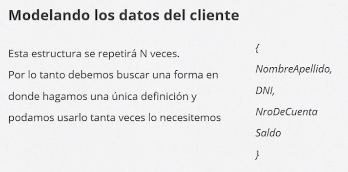
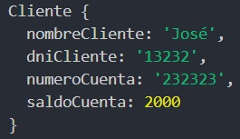

# JS-4-Alura

# Clase
```javascript
class Cliente {
  nombreCliente;
  dniCliente;
  numeroCuenta;
  saldoCuenta;
}

const cliente1 = new Cliente();

cliente1.nombreCliente = 'José';
cliente1.dniCliente = '13232';
cliente1.numeroCuenta = '232323';
cliente1.saldoCuenta = 2000;

console.log(cliente1);
```


# El paradigma de la programación orientada a objetos

https://ljcl79.medium.com/el-paradigma-de-la-programaci%C3%B3n-orientada-a-objetos-d8a662a79fb9  

Cuando decimos que tenemos un modelo en digital, hablamos en POO de una **clase**, y cuando hablamos de un integrante de ese modelo nos estamos refiriendo a un **objeto** (o instancia de esa clase).

```javascript
class Animal {
    constructor(especie, tamano, habitat) {
        this.especie = especie;
        this.tamano = tamano;
        this.habitat = habitat;
    }
    alimentacion() {
        console.log("Aqui definimos como se alimenta el animal");
    }
    movimiento() {
        console.log("En este método definimos como se mueve el animal");
    }
}
```
# Definimos 2 clases con atributos y métodos

```javascript
class Cliente {
  nombreCliente;
  dniCliente;
  rutCliente;
}

class CuentaCorriente {
  numero;
  saldo;
  agencia;

  depositoEnCuenta(valor) {
    this.saldo += valor;
  }
}
```
# Creamos el constructor
```javascript
class Cliente {
  nombreCliente;
  dniCliente;
  rutCliente;
}

class CuentaCorriente {
  numero;
  saldo;
  agencia;

  constructor() {
    this.numero = '';
    this.saldo = 0;
    this.agencia = '';
  }

  depositoEnCuenta(valor) {
    this.saldo += valor;
  }
  retirarDeCuenta(valor) {
    this.saldo -= valor;
  }
}
```  
* Un método puede estar definido sin parámetros, así como puede tener uno o más parámetros. Esa es la forma de pasarle información para que podamos reutilizar su funcionalidad en diferentes escenarios.  
* Usamos métodos para identificar los comportamientos que nuestra clase tiene. Eso facilita la comunicación dentro del equipo.  
* El objetivo de los métodos es definir qué acciones puede ejecutar un objeto. El comportamiento es implementado dentro del método.
# Atributos privados
Si utilizamos **#** delante del atributo le decimos a javascript que lo trate como **privado**.  
```javascript
class Cliente {
  nombreCliente;
  dniCliente;
  rutCliente;
}

class CuentaCorriente {
  numero;
  #saldo;
  agencia;

  constructor() {
    this.numero = '';
    this.#saldo = 0;
    this.agencia = '';
  }

  depositoEnCuenta(valor) {
    if(valor > 0) {
      this.#saldo += valor;
    }
  }
  retirarDeCuenta(valor) {
    if(valor <= this.#saldo) {
      this.#saldo -= valor;
    }
  }
}
```
```javascript
cuentaDeLeonardo = new CuentaCorriente();
console.log(cuentaDeLeonardo);
```
No podemos ver el atributo.
```javascript
CuentaCorriente { numero: '', agencia: '' }
```
# Se implementa el return a los metodos
```javascript
class Cliente {
  nombreCliente;
  dniCliente;
  rutCliente;
}

class CuentaCorriente {
  numero;
  #saldo;
  agencia;

  constructor() {
    this.numero = "";
    this.#saldo = 0;
    this.agencia = "";
  }

  depositoEnCuenta(valor) {
    if (valor > 0) {
      this.#saldo += valor;
      return this.#saldo;
    }
  }
  retirarDeCuenta(valor) {
    if (valor <= this.#saldo) {
      this.#saldo -= valor
      return this.#saldo;
    }
  }
  verSaldo() {
    return this.#saldo;
  }
}
```
# Modularizando
# Exportando e Importando los módulos
En Javascript cada archivo es considerado un módulo y podemos escoger que exportar y que no exportar de él.  
En el archivo index04.js
```javascript
import {CuentaCorriente} from './CuentaCorriente.js';
```
En el archivo CuentaCorriente.js
```javascript
export class CuentaCorriente {
  numero;
  #saldo;
  agencia;

  constructor() {
    this.numero = "";
    this.#saldo = 0;
    this.agencia = "";
  }

  depositoEnCuenta(valor) {
    if (valor > 0) {
      this.#saldo += valor;
      return this.#saldo;
    }
  }
  retirarDeCuenta(valor) {
    if (valor <= this.#saldo) {
      this.#saldo -= valor;
      return this.#saldo;
    }
  }
  verSaldo() {
    return this.#saldo;
  }
}
```

# Creación del archivo package.json
`npm init`  
Me solicita el `package name: cuentasbancopopular`    
La versión: (1.0.0)  
Una description: Gestión de Cuentas del Banco Popular  
Me pide el punto de entrada para nuestro proyecto, es el archivo que node va a buscar para ejecutar, en este caso index.js, variable entry point: (index04.js)  
test command: un comando para pruebas  
git repositorio  
keywords  
author: Curso Alura  
license: (ISC)  
Me solicita confirmar y crea el archivo package.json  
Tiene todas las definiciones del proyecto  
Tengo que agregar a mano el "type": "module"  
```json
{
  "name": "cuentasbancopopular",
  "version": "1.0.0",
  "description": "Gestión de Cuentas Corrientes del Banco Popular",
  "main": "index04.js",
  "scripts": {
    "test": "echo \"Error: no test specified\" && exit 1"
  },
  "author": "Curso Alura",
  "license": "ISC",
  "type": "module"
}
```
# CuentaCorriente.js
Creamos un atributo cliente para relacionar la clase con el cliente
# Composicion de clases - relacionamos nuestras 2 clases
```javascript
export class Cliente {
  nombreCliente;
  dniCliente;
  rutCliente;
}
```
```javascript
export class CuentaCorriente {
  cliente;  
  numero;
  #saldo;
  agencia;

  constructor() {
    // en este caso cliente no es un dato primitivo,
    // es un tipo de dato, es un objeto (es la clase Cliente)
    // por eso null, es un objeto de tipo de dato Cliente
    this.cliente = null;
    this.numero = "";
    this.#saldo = 0;
    this.agencia = "";
  }

  depositoEnCuenta(valor) {
    if (valor > 0) {
      this.#saldo += valor;
      return this.#saldo;
    }
  }
  retirarDeCuenta(valor) {
    if (valor <= this.#saldo) {
      this.#saldo -= valor;
      return this.#saldo;
    }
  }
  verSaldo() {
    return this.#saldo;
  }
}

```
Creo la cuenta en el index04.js
```javascript
const cliente = new Cliente();
cliente.nombreCliente = 'Leonardo';
cliente.dniCliente = '13804050'
cliente.rutCliente = '123224'

const cuentaDeLeonardo = new CuentaCorriente();
cuentaDeLeonardo.numero = '1';
cuentaDeLeonardo.agencia = '001';
cuentaDeLeonardo.cliente = cliente;
console.log(cuentaDeLeonardo);
```
```javascript
CuentaCorriente {
  cliente: Cliente {
    nombreCliente: 'Leonardo',
    dniCliente: '13804050',
    rutCliente: '123224'
  },
  numero: '1',
  agencia: '001'
}
```
# Creo metodo transferirParaCuenta()
````javascript
export class CuentaCorriente {
  cliente;  
  numero;
  #saldo;
  agencia;

  constructor() {
    // en este caso cliente no es un dato primitivo,
    // es un tipo de dato, es un objeto (es la clase Cliente)
    // por eso null, es un objeto de tipo de dato Cliente
    this.cliente = null;
    this.numero = "";
    this.#saldo = 0;
    this.agencia = "";
  }

  depositoEnCuenta(valor) {
    if (valor > 0) {
      this.#saldo += valor;
      return this.#saldo;
    }
  }
  retirarDeCuenta(valor) {
    if (valor <= this.#saldo) {
      this.#saldo -= valor;
      return this.#saldo;
    }
  }
  verSaldo() {
    return this.#saldo;
  }
  transferirParaCuenta(valor, cuentaDestino) {
    // Retiro de una cuenta
    this.retirarDeCuenta(valor);
    // Deposito en la otra cuenta
    cuentaDestino.depositoEnCuenta(valor);
  }
}
```
